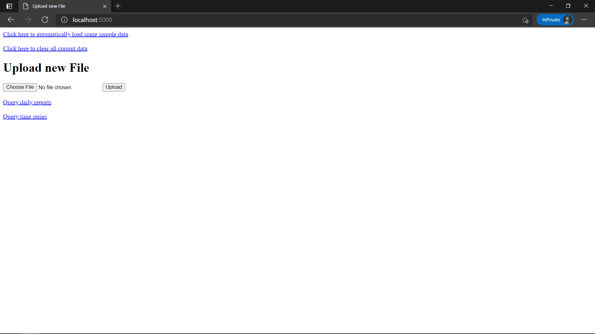
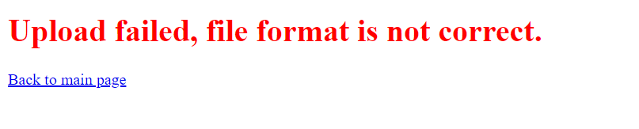

# Assignment 2

## Pair programming
- Haocheng (driver), Valerie (navigator)
    - Feature: `CSV parsing and query pages`
        - I (Haocheng) worked as the driver for programming the CSV parsing and query page display part of the
        assignment. This meant parsing the information from the CSVs into our data structure, and then writing out
        the template html pages to display the appropriate interface for users to submit a query.
        - Most of the pair programming process went pretty smoothly. I enjoyed having someone to talk through the design
        process at the start and then subsequently help during the implementation part. I found the process particularly
        helpful when we both did not know how to implement a certain function, and I could try to work it out in the
        code while my partner gave me tips while they searched online. This made the debugging process much more
        tolerable and definitely made the implementation process much more enjoyable. The design proposal we did
        together at the beginning was also very beneficial as we were both able to catch errors that the other person
        would not have spotted.
        - A part of the pair programming process that I felt didn't work too well was during some parts of debugging.
        When a feature did not work, my partner would help me debug, but it was often hard for them to convey (and
        for me to understand) what change they wanted me to make. At times we both felt it may have been better to just
        let the navigator code out what they were trying to say.
        - Overall though, I enjoyed doing the pair programming with my partner, and there were times where it was
        definitely more productive than if I were coding alone.

- Valerie (driver), Haocheng (navigator)
    - Feature: `Query output in text format`
        - I (Valerie) was the driver for programming the formatting and output of the queries in text format.
        This included processing data derived from CSVs in both the “daily reports” and “time series” formats,
        creating and formatting output to be visually pleasing, and updating the tests to match the intended output.
        - The pair programming process went quite well. The feature was not super complex, but I did run into a few issues
        that made the implementation more difficult. With the involvement of my partner we managed to identify the problems
        and come up with workarounds. Afterwards, my partner helped me understand the unit testing setup so that I could
        edit the relevant tests to be successful with the intended output.
        - At first I felt self-conscious about someone watching me write code. I adopted a style that was slower and more
        careful in order to avoid making any glaring mistakes my partner would have to point out. After a while it became clear
        that my partner was only there to support me so I became a bit more relaxed. If I was doing this exercise with somebody who
        was more judgmental I could see it being a more difficult time.
        - I found pair programming a bit more stressful than coding on my own but I was probably more productive. When doing
        solo work I often get distracted or try to do multiple things at once so this way definitely helped me maintain focus.

## Program design
We chose a very modular design for this application. All of our functionality is broken down into modules (module
pattern), and you can easily replace or modify a module without affecting the rest of the app. We felt like this was
the right choice because of how the app specifications were defined. It's clear that you should have some part of your
program do the parsing of the CSV data. Another part should help with the queries and storage. And the flask part
should provide the api endpoints for the other modules.

## Setup and Functionality
We have deployed our application at [https://csc301-a2-vr-hhc.herokuapp.com/](https://csc301-a2-vr-hhc.herokuapp.com/).
However, due to how heroku hosts the application, the data submitted is not persistent (it will disappear once in
a while), so we recommend that you test our assignment locally, setup instructions are below:

To run our assignment, simply run the following set of commands:
```shell script
git clone git@github.com:csc301-winter-2021/assignment-2-15-hhc97-valerieroussel.git
cd assignment-2-15-hhc97-valerieroussel
pip install -r requirements.txt
cd COVIDMonitor
python3 main.py
```
This should get our app running on `http://localhost:5000/`.

Our main page should look like this:  
  
To add a data file: click the `Choose File` button and select the file you want to add from your own machine.
Only CSV files that fit either the “Daily Reports” or “Time Series” format will be accepted (our app automatically
checks).

Alternatively, you can choose to click the link at the very top that says
`Click here to automatically load some sample data` to load the two sample CSVs that were provided in the assignment
handout. From there, you can test out the queries without having to upload a file.

If you choose to upload a file, then upon success, you should see a page that looks like this:  
  
If the upload format is not correct, then the upload will fail, and you will be shown this page:  
  
Once some data has been uploaded successfully, you can then click either `Query daily reports` or `Query time series`.
This will take you to our query interface which looks like this:  
  
From here, you can select the options you would like to query with and the return format of the data. Once you click
submit, the queried data will be shown in the browser screen.
We have implemented 3 return formats as shown:  
  
  
  
Uploading the same file (with modifications) will allow you to update the data in the app.

- **The requirements of the assignment functionality are satisfied as follows**:
    1. Adding new data files
        - You can upload files into our application using the upload button on the main page.
    2. Update existing files
        - Once you upload a file, any old data from the same file will be updated.
    3. Query data
        - Our app allows queries for any combination of countries, provinces, and states. The combined keys
        field is included in this functionality. You can also choose which data field to query from the four that
        are available. You can also query the data for any date or a number of dates.
    4. Return formats
        - We support returning data in `JSON`, `CSV`, and `printed text` format.

It should be noted that our application is dependent on the backend flask API. The web interface is just a wrapper
which makes it easier to use our application. As such, we did not spend much time on trying to make it beautiful
(there is no CSS).

## Tests
We set up CI actions to run the coverage checks each time we make a change to our app.

As of right now, our checks are [](https://github.com/csc301-winter-2021/assignment-2-15-hhc97-valerieroussel/actions/workflows/coverage_check.yml)
and we have 87% line coverage:
```text
tests/unit_tests.py .......................                              [100%]

----------- coverage: platform linux, python 3.8.8-final-0 -----------
Name                            Stmts   Miss  Cover
---------------------------------------------------
COVIDMonitor/__init__.py            0      0   100%
COVIDMonitor/db_utils.py           15      0   100%
COVIDMonitor/main.py               67     25    63%
COVIDMonitor/parsing_utils.py      98      9    91%
COVIDMonitor/query_utils.py        97      3    97%
---------------------------------------------------
TOTAL                             277     37    87%


============================== 23 passed in 0.80s ==============================
```

## Code craftsmanship
We mainly used PyCharm to code this assignment as it has good linting and support for flask. All our module functions
have type documentations are are documented properly. Python's PEP8 style was followed.

## Organization
Instructions to run the app are provided in the [setup and functionality](#setup-and-functionality) part of this readme.
